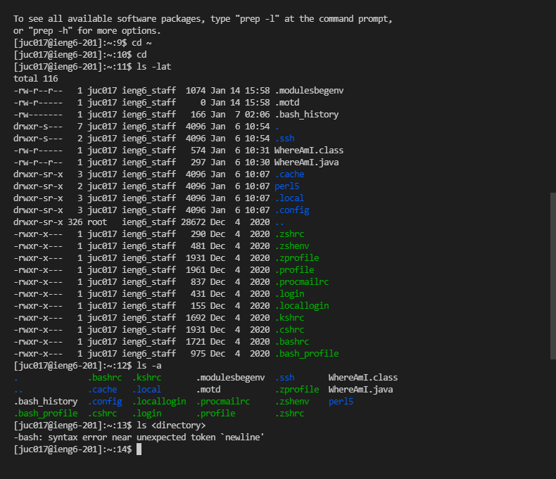

# lab 1 report - Junlin Chen
# *how to log into a course-specific account on ieng6*
## 1.Visual Studio Code

* go to the website https://code.visualstudio.com/ to download the VS code.
## 2.Remotely Connecting

* First, you should download OpenSSH to your computer using the [link](https://docs.microsoft.com/en-us/windows-server/administration/openssh/openssh_install_firstuse) and follow the instruction.
* Then using this link [link](https://sdacs.ucsd.edu/~icc/index.php) to found your account for CSE15L
* Next open the VScode, in the terminal, type in `$ ssh cs15lwi22zz@ieng6.ucsd.edu` (you should replace it by your own account) and enter your password.
## 3. Run Some Commands

* try to run these command and to see what happened.
* ## `cd ~`
* ## `cd`
* ## `ls -lat`
* ## `ls -a`
* ## `ls <directory>` where `<directory>` is `/home/linux/ieng6/cs15lwi22/cs15lwi22abc`, where the abc is one of the other group members’ username
* ## `cp /home/linux/ieng6/cs15lwi22/public/hello.txt ~/`
* ## `cat /home/linux/ieng6/cs15lwi22/public/hello.txt`
* you can use Ctrl-D to exit your account.
## 4.Moving Files over SSH with scp

* we will try to copy a file using the command scp.
* create a file on VS code called `WhereAmI.java` and put the following contents into it:
```
class WhereAmI {
  public static void main(String[] args) {
    System.out.println(System.getProperty("os.name"));
    System.out.println(System.getProperty("user.name"));
    System.out.println(System.getProperty("user.home"));
    System.out.println(System.getProperty("user.dir"));
  }
}
```
* Then run it using javac and java. In the terminal, run this command `scp WhereAmI.java cs15lwi22zz@ieng6.ucsd.edu:~/` and record how long it take you to done all these step.
## 5. SSH Keys

* since repetively typing our password is annoying, we are using `-ssh` keys to help us avoid that. 
* Here’s what you should run to set this up:
```
# on client (your computer)
$ ssh-keygen
Generating public/private rsa key pair.
Enter file in which to save the key (/Users/joe/.ssh/id_rsa): /Users/joe/.ssh/id_rsa
Enter passphrase (empty for no passphrase): 
Enter same passphrase again: 
Your identification has been saved in /Users/joe/.ssh/id_rsa.
Your public key has been saved in /Users/joe/.ssh/id_rsa.pub.
The key fingerprint is:
SHA256:jZaZH6fI8E2I1D35hnvGeBePQ4ELOf2Ge+G0XknoXp0 joe@Joes-Mac-mini.local
The key's randomart image is:
+---[RSA 3072]----+
|                 |
|       . . + .   |
|      . . B o .  |
|     . . B * +.. |
|      o S = *.B. |
|       = = O.*.*+|
|        + * *.BE+|
|           +.+.o |
|             ..  |
+----[SHA256]-----+
```
* if you are using Windows system, you should go to this Link and follow the steps - [Link](https://docs.microsoft.com/en-us/windows-server/administration/openssh/openssh_keymanagement#user-key-generation)
Now, we have to copy the public key to the .ssh directory of your user account on the server.
```
$ ssh cs15lwi22zz@ieng6.ucsd.edu
<Enter Password>
# now on server
$ mkdir .ssh
$ <logout>
# back on client
$ scp /Users/joe/.ssh/id_rsa.pub cs15lwi22@ieng6.ucsd.edu:~/.ssh/authorized_keys
# You use your username and the path you saw in the command above
```
* After you down this, you don't need to type your password when using `-scp` or `-ssh`
## 6.Optimizing Remote Running
* you can write  acommand behind the ssh command to run it in the remote server like `$ ssh cs15lwi22@ieng6.ucsd.edu "ls"` 

you may also run multiple commands on the same line by using semicolons. As an example,

you can also used the up-arrow to recall the previous command and the ctrl-arrow to alter the comment.

you can used scp to copy the code from my machine to the distant server, then built the code that was copied, and ran the code that was produced on the remote server on the same line.


