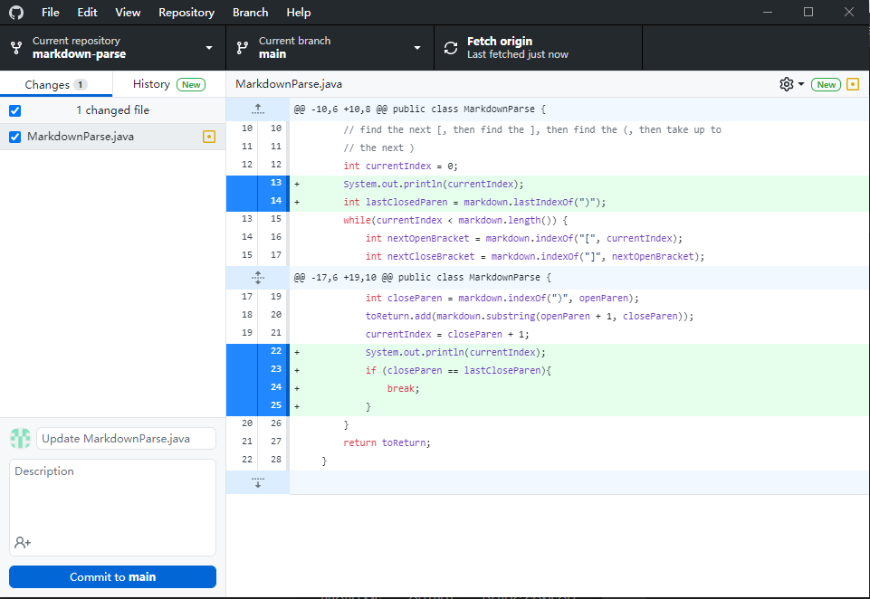
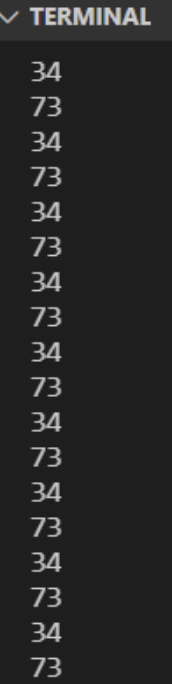
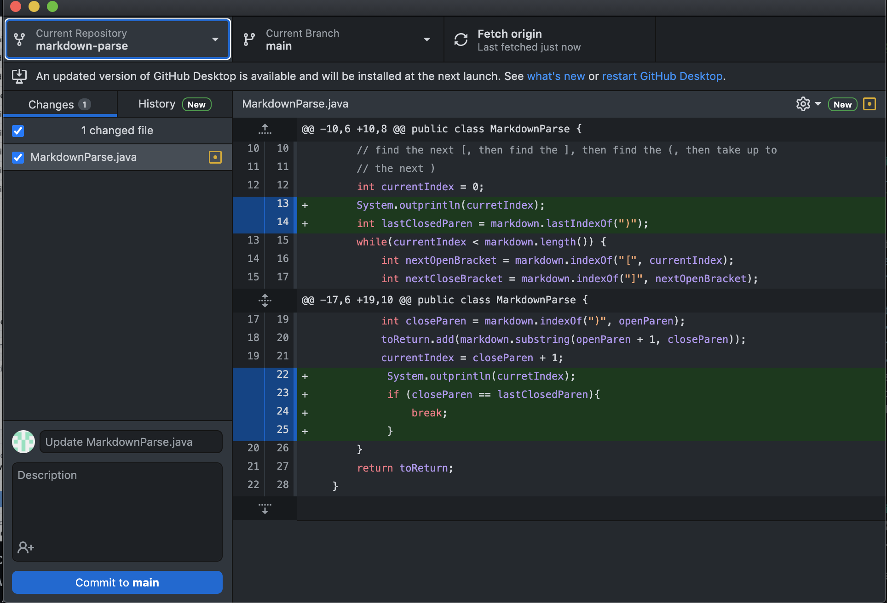
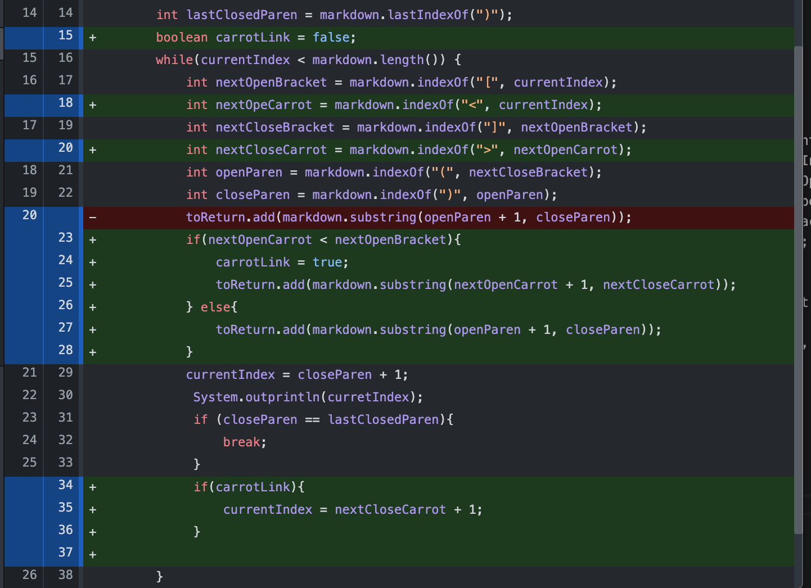
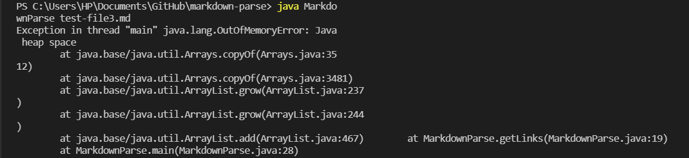

## Lab Report Week 4

# first code change - endless loop

after adding the line after the link, the program will enter the infinite loop

Link to the test file.
[test](https://github.com/atruong39/markdown-parse/blob/bdc40bdc3e7d38fce63eb4163e5b046d6680e3bf/new-test.md)
Because the empty lines makes the currentidex be less than the size of the file so that the while loop won't stop and continues print out the index. In order to fix it, we add a if statement that cause the break action.
```
  java -cp lib/junit-4.13.2.jar:lib/hamcrest-core-1.3.jar:. MarkdownParse new-test.md
```

# second code change - Reading through entire file
There was an issue reading files that had multiple links with parentheses, so we used lastIndexOf to find the last parenthese to got all the links.

Link to the test file.
[test](https://github.com/MichaelRuddy/cse15l-lab-reports/blob/5dd0f9e502035ca18199b9c5515d9fd8971fc689/new-test3.md)
when it cotains mutiple links the output will be mess up the bug is that LAST occurance of a parenthese could not be found, so we used the lastIndexOf command instead.
```
  java -cp lib/junit-4.13.2.jar:lib/hamcrest-core-1.3.jar:. MarkdownParse new-test3.md
  [something.com]
```

# Third code change - Multiple Delimeters
We discovered that some markdown links are contained within carrots rather than in parentheses.

Link to the test file.
[test](https://github.com/MichaelRuddy/markdown-parse/blob/a85f5689198c704fd8bfb859ff576ee76d8b5018/test-file-1)
When the link utilized carrots instead of parentheses, the symptom was erroneous output; the failure-inducing input was when the md file had carrots; and the problem was that we only had a delimter for parentheses, not carrots. We solved the problem by installing a second delimeter for carrots.
```
  java -cp lib/junit-4.13.2.jar:lib/hamcrest-core-1.3.jar:. MarkdownParse testt-file-1.md
```

