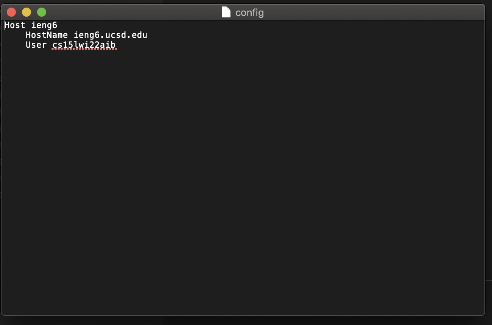
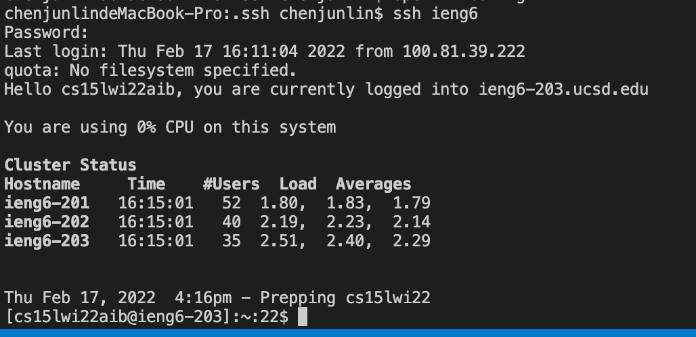
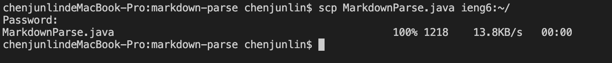

# **Lab report Week 6**

first usig the command ``cd ~/.ssh`` to change directory to ~/.ssh and using the code `` open -t config`` to open a file. Then put in the code
&nbsp;
    Host ieng6
        HostName ieng6.ucsd.edu
        User cs15lwi22aib
&nbsp;

like this:

now we can use only alias to connect to the remote server like this:

also we can copy file to the server using code ``scp MarkdownParse.java ieng6:~/``

