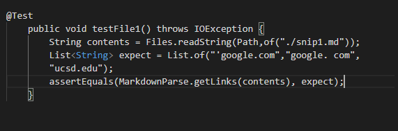
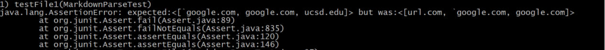
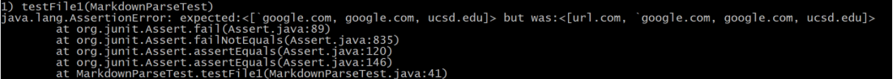
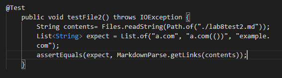
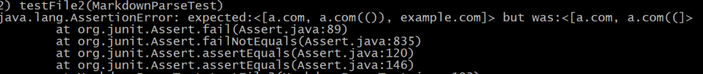
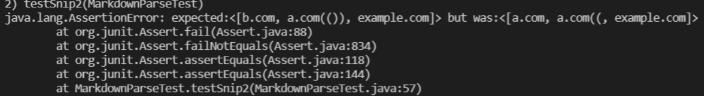
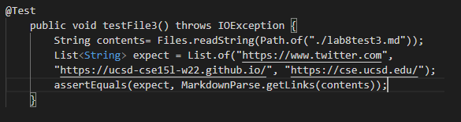
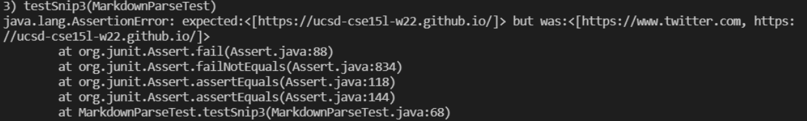
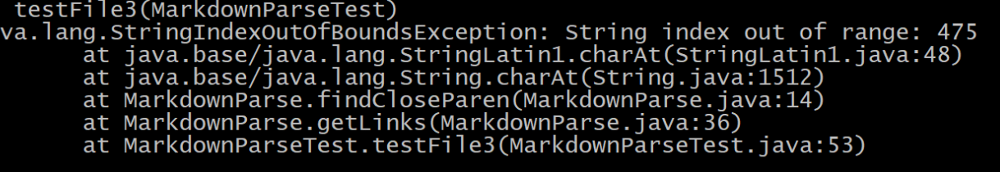

## Lab Report Week 8
[My repository](https://github.com/junlinchen12138/markdown-parse)
 [reviewed repository](https://github.com/5ean-github/markdown-parse)

# snippet 1
Test:

Espected output: ``['google.com, google.com, ucsd.edu]``
My output:
 
reviewed code output:
 
As backticks don't have different symbols for open and close, I could simply use a counter to determine which backtick is open/close and store pairs of open/close backtick
indexes.

# snippet 2
Test:

 

Espected output: ``[a.com, a.com(()), example.com]``
My output:
 
reviewed code output:
 
A simple code change could not fix this program. Rather than searching directly for the next closing parentheses, I could instead add a method similar to the one in Lab 8 that
searches for the last parentheses

# snippet 3
Test:

 

Espected output: ``[https://ucsd-cse15l-w22.github.io/]``
My output:
 
reviewed code output:
 
In test case 3, there would be an easy code change as it would just be a matter of trimming the white space between brackets and parentheses when getting links.

 

