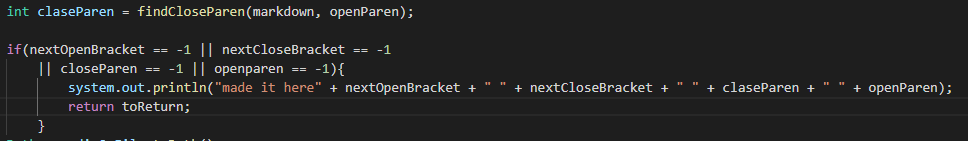

## Lab report 5 - week 10

For both tests, I use command ``diff`` to found the differences.

# Test 497:

The test content is `[link](foo\(and\(bar\))`

The provided implmentation is `[]`

My implmentation is `[foo\(and\(bar\)]`

The expected Output is `[foo\(and\(bar\)]`

In this case, my implmentation is correct becasue it provides a link
By debuging the code, I found that it couldn't found the closing parentheses after the first opening parentheses.
And code that is wrong is the resigned of the `closeParen`.

# Test 498:

The test content is `[link](<foo(and(bar)>)`

The provided implmentation is `[]`

My implmentation is `[<foo(and(bar]`

The expected Output is `[foo(and(bar]`

In this case, neither implementation is correct because the Link should be included.
My code could not detect the bracket. in order to fix it, we have to write a code to 
find if offending brackets are within <>.

